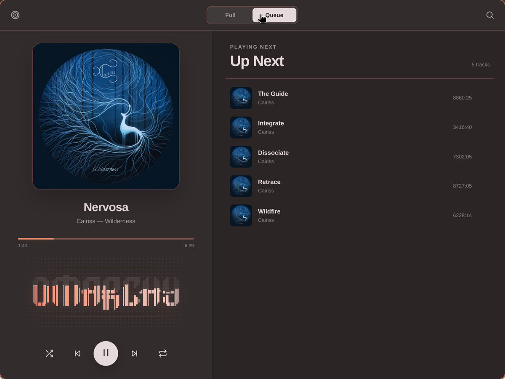

# Apple Music for Omarchy

Apple Music in the Omarchy bar: a theme-aware Chromium dropdown for browsing, a compact queue for listening, and an optional mini-player that stays within reach.



## Features

- Full `music.apple.com` interface in a bar-anchored Chromium app window
- Compact Queue view with artwork, progress, playback controls, live Up Next selection, and a real system-audio spectrum clipped into Omarchy's pixel wordmark
- Explicit, persistent **Full** / **Queue** switch plus a shared catalog-search action
- Compact monochrome bar icon or inline now-playing controls, switchable without opening settings
- Playback continues when the dropdown is hidden on its named Hyprland special workspace
- Dropdown positioning for bars on every edge, with multi-monitor geometry and small-screen clamping
- Pointer remains on the bar when the dropdown receives focus
- Live colors from the active Omarchy theme, including fast transitions between light and dark palettes
- Dedicated Chromium profile for a stable Apple session and isolated media metadata
- Runtime-only Hyprland rules, with no edits to the user's compositor configuration
- Fixed 90% profile zoom that keeps Apple's desktop layout active at dropdown width without Chromium's zoom popup

## Install

```bash
omarchy plugin add https://github.com/melonamin/omarchy-apple-music.git --enable
```

The shell discovers the plugin and adds its widget to the right side of the bar. Sign in to Apple Music the first time the dropdown opens.

To remove it:

```bash
omarchy plugin remove melonamin.apple-music
hyprctl reload      # drops the runtime-only window rule
```

The dedicated browser profile is retained so uninstalling or updating the plugin does not destroy the saved Apple session. Delete `$XDG_DATA_HOME/omarchy-apple-music` separately if you also want to remove that local state.

## Requirements

Omarchy 4 (Quattro) or newer, running `omarchy-shell` on Hyprland.

The stock Omarchy installation already provides Chromium, `jq`, Hyprland, Quickshell, PipeWire's Pulse compatibility layer, `parec`, `od`, and `awk`, so the plugin adds no package dependencies. Apple Music playback still depends on Chromium's codec and DRM support; a build without a working Widevine CDM may load the site but refuse protected tracks.

## Use

| Input | Compact icon | Mini-player |
|---|---|---|
| Left click | Open or hide Apple Music | Play or pause |
| Right click | Open or hide Apple Music | Open or hide Apple Music |
| Middle click | Switch to mini-player | Switch to compact icon |
| Scroll up / down | Previous / next track | Previous / next track |

Clicking another window hides the dropdown without interrupting playback. Inside the dropdown, **Full** opens Apple's complete interface and **Queue** opens the compact listening view; the choice is remembered explicitly between sessions.

The Queue visualizer follows play and pause state and uses the active theme accent. While the dropdown is visible and Apple Music is playing, it monitors only the dedicated Chromium app's PipeWire stream, reduces it to 32 frequency bands, and draws those bands inside the official Omarchy wordmark. If that stream is unavailable, the wordmark falls back to a synthetic animation.

## Bar setting

The default presentation is the fixed-width monochrome icon. Set the presentation directly with `omarchy bar set`:

```bash
omarchy bar set melonamin.apple-music display player
omarchy bar set melonamin.apple-music display icon
```

`display` accepts `icon` or `player`; the legacy value `status` remains an alias for `player`.

## State and privacy

The browser profile lives at `$XDG_DATA_HOME/omarchy-apple-music/chromium`, falling back to `~/.local/share/omarchy-apple-music/chromium`. It contains the Apple login session and normal site data for the dedicated app.

The plugin stages its bundled Manifest V3 extension under `$XDG_RUNTIME_DIR/omarchy-apple-music/extension`, falling back to the plugin's data directory only when no runtime directory exists. The extension runs only on `https://music.apple.com/*`, requests local extension storage only to remember the selected Full/Queue view, and reads local theme and spectrum files generated by the plugin. High-frequency spectrum updates therefore stay in tmpfs instead of writing to persistent storage.

The compact view uses Apple Music's page-local MusicKit player to expose sanitized playback state: title, artist, album, artwork URL, duration, position, play state, repeat, shuffle, and queue entries. Account credentials and authorization tokens never cross that bridge. The bar uses Chromium's standard MPRIS interface.

MPRIS carries controls and metadata, not audio samples. For the visualizer, the service finds the PipeWire/Pulse sink input whose process belongs to the dedicated Apple Music Chromium tree and monitors that stream directly. PCM is downmixed in memory to 24 kHz mono, transformed into 32 normalized bands, and immediately discarded. Only the numeric band levels are published to the runtime extension; no PCM is persisted, sent over the network, or mixed with other applications' audio. Capture starts only while the dropdown is open and playback is active, and stops when it is hidden or paused.

## How it works

```text
Omarchy bar widget ──▶ Service.qml ──▶ Hyprland-managed Chromium app
        ▲                    │                       │
        └──── MPRIS state ───┘              bundled MV3 extension
                             │                       │
                             ├── theme palette ──────┤
                             │                       └── local MusicKit state
                             │
                             └── PipeWire app monitor ──▶ 32-band runtime spectrum
```

The Chromium window remains alive on `special:melonamin-apple-music` when hidden. Showing it moves and focuses the same window at the current bar edge; hiding it parks the window again, so playback and the signed-in session continue uninterrupted.

Theme changes are published as a small local palette and applied to an open dropdown during Omarchy's own transition. The extension and spectrum analyzer are bundled with the plugin and are never downloaded at runtime.

## IPC

```bash
omarchy-shell apple-music status
omarchy-shell apple-music show
omarchy-shell apple-music hide
omarchy-shell apple-music toggle
omarchy-shell apple-music playPause
omarchy-shell apple-music next
omarchy-shell apple-music previous
omarchy-shell apple-music refreshTheme
```

## Tests

```bash
node --test tests/model.test.js tests/extension.test.js tests/player-model.test.js tests/player-bridge.test.js
tests/integration.sh
```

The model suites cover window matching, scaled monitor geometry, every bar edge, small displays, PID-scoped MPRIS selection, palette validation, player-state normalization, and MusicKit command routing. The spectrum test feeds a known 1 kHz tone through the analyzer and verifies its dominant band. The integration script validates both manifests and inspects live shell/compositor state without launching or closing Apple Music.

An opt-in end-to-end run uses a disposable browser profile, parks its window on the special workspace, and closes it again. It skips itself if a real Apple Music window is open.

```bash
OMARCHY_APPLE_MUSIC_E2E=1 tests/integration.sh
```

## License

MIT

Apple and Apple Music are trademarks of Apple Inc. This project is independent and is not endorsed by or affiliated with Apple.
